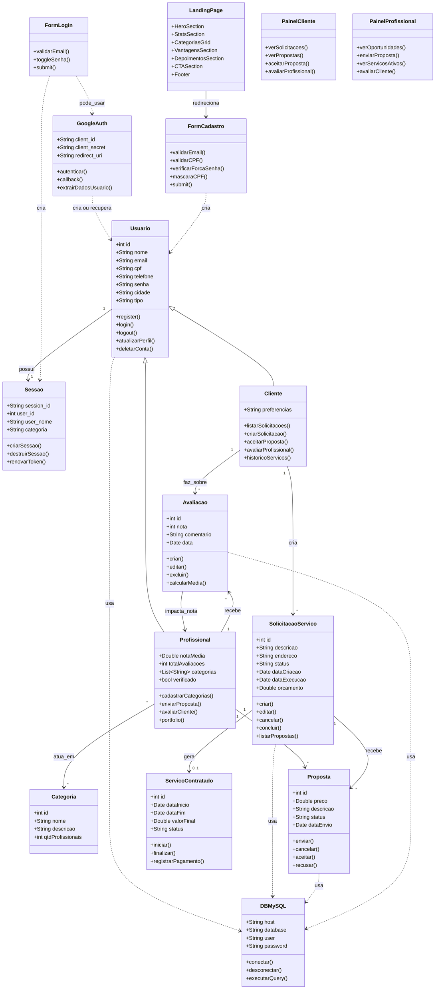

# ServiConnect - Diagrama de Classes UML (modelo GetNinja)

## Diagrama Completo

## Legenda

| Relação | Símbolo | Significado |
|---------|---------|-------------|
| Herança | `Cliente → Usuario` | Cliente herda de Usuario |
| Composição | `"1" → "*" ` | Um para muitos |
| Dependência | `..>` | Usa/depende de |

## Descrição dos Pacotes

### Autenticação
- **Usuario** entidade central com dados pessoais e credenciais
- **GoogleAuth** implementa OAuth 2.0 para login via Google
- **Sessao** mantem o estado da sessão do usuário logado

### Usuários
- **Cliente** solicita serviços e avalia profissionais
- **Profissional** envia propostas e recebe avaliações
- **Categoria** agrupa profissionais por especialidade

### Serviços
- **SolicitacaoServico** criada pelo cliente com descrição e endereço
- **Proposta** enviada pelo profissional em resposta à solicitação
- **ServicoContratado** gerado quando proposta é aceita

### Avaliação
- **Avaliacao** conecta cliente e profissional com nota e comentário

### Frontend
- **LandingPage** página principal com hero, stats, categorias, depoimentos
- **FormLogin / FormCadastro** formulários com validação JS
- **PainelCliente / PainelProfissional** dashboards pós-login
